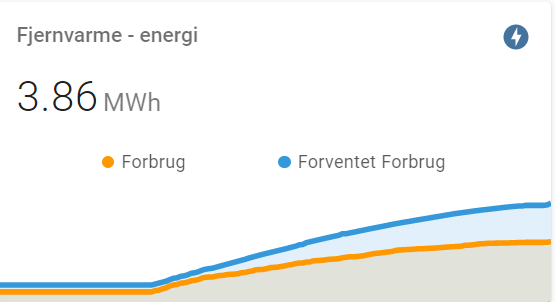
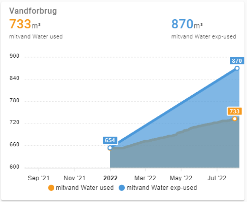
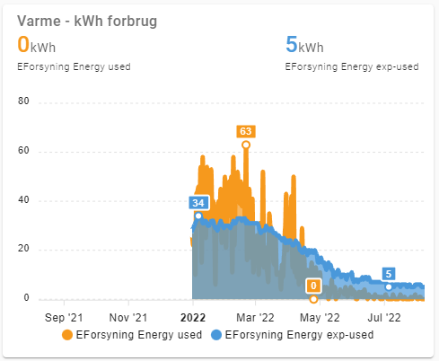

# eforsyning

[](https://github.com/custom-components/hacs)

The `eforsyning`component is a Home Assistant custom component for monitoring your regional heating supply data from eforsyning.dk

*This custom component is to be considered a hobby project, developed as I see fit, and updated when I see a need, or am inspired by a feature request.  I am open for suggestions and issues detailing problems, but please don't expect me to fix it right away.*

## Installation
---
### Manual Installation
  1. Copy eforsyning folder into your custom_components folder in your hass configuration directory.
  2. Configure the `eforsyning` sensor.
  3. Restart Home Assistant.

### Installation with HACS (Home Assistant Community Store)
  1. Ensure that [HACS](https://hacs.xyz/) is installed.
  2. Search for and install the `eforsyning` integration.
  3. Configure the `eforsyning` sensor.
  4. Restart Home Assistant.


## Configuration
---
Fully configurable through config flow.
  1. Head to configuration --> integration
  2. Add new and search for eforsyning
  3. Enter credentials and send

### Credentials and supplier ID
This part is a little tricky, but hang on:
  1. Username and password is the credentials written on the bill, and the ones you use to
     login with on the website normally.
  2. The supplier ID is a little more involved
  3. Visit the main page for [eforsyning](https://eforsyning.dk).
  4. If you are redirected to the login site of your regional supplier, click the small
      link "change supplier" (skift forsyning) to clear that cookie and go back.
  5. On the web page you must find your supplier, and click it.  You are redirected to the
     login page for your supplier.
  6. Press F12 in your browser (chrome at least) to get the developer tools.
     Select the "Network" tab and type "getv" in the search field.
  7. Use your username and login credentials to login.
  8. In the Network traffic you should see a single line like this:
     `https://<SUPPLIER URL>/umbraco/dff/dffapi/GetVaerkSettings?forsyningid=<SUPPLIER ID (lots of digits and letters)>`
  9. Copy these numbers and letters into Home Assistant along with your user name and password, and you should be ready to go.

## State and attributes
---

Depending on checking the switch for heating or water supply, a specific set of sensors are made available to Home Assistant.

### Sensors for heating supply

Many sensors are created - 14 in total actually.  The naming scheme is `sensor.eforsyning.<name>`. (Unless you changed the "eforsyning" name).

The names are hopefully self-explanatory:

* energy-start
* energy-end
* energy-exp-end  (expected end value that period)
* energy-used
* energy-exp-used (expected used value that period)
* energy-total-used (total of used energy in the current billing period)
* energy-use-prognosis (expected used value end of billing period)
* water-start
* water-end
* water-exp-end
* water-used
* water-exp-used
* water-total-used (total of used water in the current billing period)
* water-use-prognosis (expected used value end of billing period)
* temp-return
* temp-exp-return
* temp-cooling
* temp-forward

Additionally all sensors have historical data available for use with for example ApexChart.  This data is not saved to the database and it only exists on the latest data point.  The historical data exists because the integration fetches all data for the full billing year to avoid averaging on the data points.

As attribute data, the following is available:

* Data
  * DateFrom
  * DateTo
  * kWh-Start
  * kWh-End
  * kWh-Used
  * kWh-ExpUsed
  * kWh-ExpEnd
  * M3-Start
  * M3-End
  * M3-Used
  * M3-ExpUsed
  * M3-ExpEnd
  * Temp-Forward
  * Temp-Return
  * Temp-ExpReturn
  * Temp-Cooling
* Billing
  * Date
  * MWh-Price
  * M3-Price
  * Amount-MWh
  * Amount-M3
  * Amount-VAT
  * Amount-Total
  * Amount-Paid
  * Amount-Remaining

### Sensors for water supply

A different set of sensors are created, 8 in total.  The naming scheme is `sensor.eforsyning.<name>`. (Unless you changed the "eforsyning" name).

* water-start
* water-end
* water-exp-end
* water-used
* water-exp-used
* water-ytd-used (total consumption year-to-date)
* water-exp-ytd-used (expected total consumption year-to-date))
* water-exp-fy-used (expected full year consumption prognosis)

As attributes the following data is available:

* DateFrom
* DateTo
* Start
* End
* Used
* ExpUsed
* ExpEnd

## Debugging
---
It is possible to debug log the raw response from eforsyning.dk API. This is done by setting up logging like below in configuration.yaml in Home Assistant. It is also possible to set the log level through a service call in UI.  

```
logger: 
  default: info
  logs: 
    pyeforsyning.eforsyning: debug
```

## Examples
---

### Daily and expected energy use some days back
Below is an example of how to display energy used vs expected in a graph. 




**Requirements**

* Recorder component holding minimum the number of days the average display should cover.
* The custom component mini-graph-card (which is great)

```
type: vertical-stack
cards:
  - type: 'custom:mini-graph-card'
    hours_to_show: 720
    smoothing: false
    group_by: date
    name: Fjernvarme - energi
    entities:
      - entity: sensor.eforsyning_energy_used
        name: Forbrug
      - entity: sensor.eforsyning_energy_exp_used
        name: Forventet Forbrug
  ...add more cards here...
  ```

### Apexchart example

There is so much which can be done with ApexChart.  This is one example of charting the water meter reading actual versus expected.

Key points below:
* While all sensors have the same attributes, you should use one with the right unit of measurement to get M3, kWh or degrees C in the chart.
* Check if data is compatible in value range.  A Range of 100 does not look like much together with a value of range 10000
* The attribute value is the part ["End"], ["ExpEnd"] below.  Change just these to extract other data, the rest can stay the same.



```
type: custom:apexcharts-card
graph_span: 365d
span:
  end: day
header:
  show: true
  title: Vandforbrug
  show_states: true
  colorize_states: true
all_series_config:
  show:
    legend_value: false
    datalabels: false
    extremas: true
    in_brush: true
  float_precision: 3
  type: area
  invert: false
series:
  - entity: sensor.mitvand_water_used
    type: area
    data_generator: |
      return entity.attributes.data.map((start, index) => {
        return [new Date(start["DateFrom"]).getTime(), entity.attributes.data[index]["End"]];
      });
  - entity: sensor.mitvand_water_exp_used
    type: area
    data_generator: |
      return entity.attributes.data.map((start, index) => {
        return [new Date(start["DateFrom"]).getTime(), entity.attributes.data[index]["ExpEnd"]];
      });

```

### Another Apexchart example

This one shows the kWh consumption of the heating versus the expected.  It was great to see the Summer coming along and energy consumption heading towards zero.



The template is the same as above, just using different sensors and attributes:

```
type: custom:apexcharts-card
graph_span: 365d
span:
  end: day
header:
  show: true
  title: Varme - kWh forbrug
  show_states: true
  colorize_states: true
all_series_config:
  show:
    legend_value: false
    datalabels: false
    extremas: true
    in_brush: true
  float_precision: 3
  type: area
  invert: false
series:
  - entity: sensor.eforsyning_energy_used
    type: area
    data_generator: |
      return entity.attributes.data.map((start, index) => {
        return [new Date(start["DateFrom"]).getTime(), entity.attributes.data[index]["kWh-Used"]];
      });
  - entity: sensor.eforsyning_energy_exp_used
    type: area
    data_generator: |
      return entity.attributes.data.map((start, index) => {
        return [new Date(start["DateFrom"]).getTime(), entity.attributes.data[index]["kWh-ExpUsed"]];
      });
```
